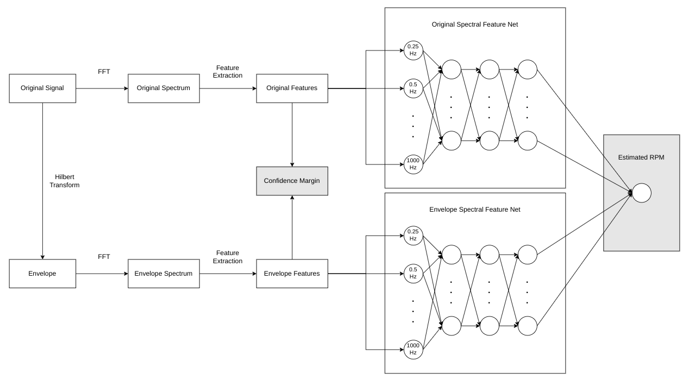

## RPM Deep Estimator (rpm-deep-estimator)

A deep learning-based RPM estimator based on spectral features extracted from vibration signals of rotating machines.

- Developer: _Leonardo Franco de Godói_
- GitHub profile: _https://github.com/lfgodoi_
- Contact: _eng.leonardogodoi@gmail.com_

### Motivation

The shaft rotation speed is a crucial parameter for condition monitoring of rotating machines. Knowing this speed enables the identification of key spectral components, which are essential for diagnosing potential faults. However, since a rotation sensor is not always available, estimating it from the vibration signal can be highly beneficial.

### Explanation

Given a vibration signal collected from a machine at a specified sampling frequency, the shaft speed (RPM) is estimated using a deep neural network that processes features extracted from both the original and envelope spectra. The envelope is computed using the Hilbert Transform, whereas the spectrum is computed using the Fast Fourier Transform (FFT). The neural network employed in this algorithm contains several intermediate layers and a single output neuron enabling the prediction of a continuous value. It processes well-defined frequency bands with 0.25 Hz resolution, mapping the amplitudes that most closely match the expected frequencies, so that the number of input neurons is kept fixed regardless of the signal size.

### Inputs

- `signals (List[List[float]])`: signals to have their RPM estimated.
- `sampling_frequencies (List[float])`: sampling frequencies used to acquire each of the signals.

### Outputs

- `estimated_rpms (List[float])`: the estimated RPM value.
- `confidence_margins (List[float])`: the estimation confidence margin.

### Conditions

- Minimum sampling frequency admitted: 4 kHz.
- Maximum shaft speed covered: 30,000 RPM.

### Running the app directly from the Python script

It is usually common to need to run the app directly using Python for development and testing purposes, without the need to use Docker, which will only be required for its automatic deployment.

_Inside the project folder, create a virtual environment._

    python3 -m venv .venv

_Activate the virtual environment._

    source .venv/bin/activate

_Update the Pip._

    pip install --upgrade pip

_Install the app dependencies._

    pip install -r requirements.txt

_Run the app._

    python app/main.py
